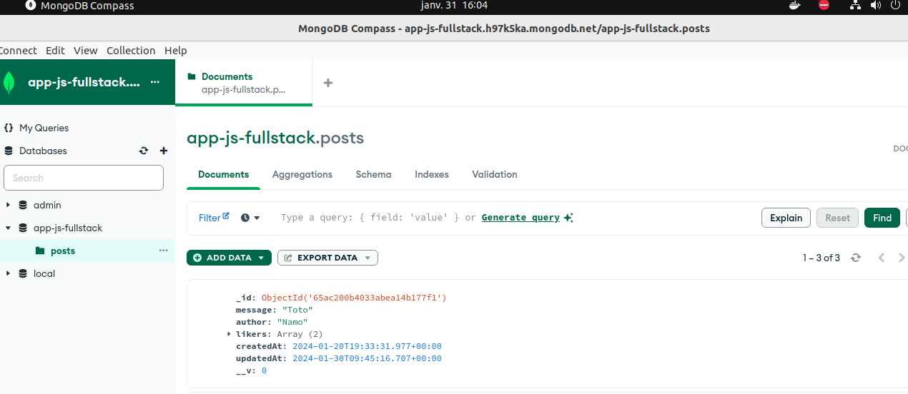
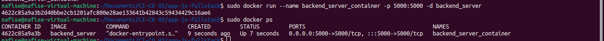

# Projet réseau social décentralisé

# Ce projet est le début d'un réseau social décentralisé dans lequel les données des utilisateurs ne sont pas partagées avec des organisations tierces.

## Les fonctionnalités à développer prochainement sont les suivantes :
-   Intégration de la technologie Blockchain : Permettre le partage transparent des informations entre les utilisateurs.
-   Système de Récompense en Cryptomonnaie : Les utilisateurs gagnent des cryptomonnaies en fonction de leur activité sur la plateforme. Plus ils sont actifs, plus ils en gagnent.
-   Authentification et Messagerie : Développer un système de login avec JWT (JSON Web Token) pour sécuriser l'accès des utilisateurs. Ensuite, mettre en place un système de messagerie pour permettre aux utilisateurs d'interagir entre eux.

## Stack Technologique :

Ce projet est réalisé avec le stack MERN (MongoDB, Express, React, Node).

## Configuration et Installation :

- Installation des Dépendances Backend :`npm i` pour installer les dépendances Back
- Configuration de MongoDB : Entrer son MONGO URI perso dans .env enfin de se connecter à sa base de donnée
- Installation des Dépendances Frontend : `cd frontend` puis `npm i` pour installer les dépendances Front

## Schéma de la Base de Données MongoDB : 

-   
-   

## Les routes pour les requêtes POST,GET,PUT,DELETE et PATCH :

-   GET "/" (getPosts) : Cette route permet de récupérer toutes les publications. Lorsqu'un utilisateur effectue une requête GET à la racine de l'API, la fonction getPosts du contrôleur est appelée pour renvoyer la liste des publications.

-   POST "/" (setPosts) : Cette route permet d'ajouter une nouvelle publication. Lorsqu'un utilisateur effectue une requête POST à la racine de l'API avec les données de la nouvelle publication, la fonction setPosts du contrôleur est appelée pour enregistrer cette publication dans la base de données.

-   PUT "/:id" (editPost) : Cette route permet de modifier une publication existante. L'utilisateur doit fournir l'identifiant de la publication qu'il souhaite modifier dans l'URL, et les nouvelles données de la publication dans le corps de la requête. La fonction editPost du contrôleur est alors appelée pour effectuer la modification.

-   DELETE "/:id" (deletePost) : Cette route permet de supprimer une publication existante. L'utilisateur doit fournir l'identifiant de la publication à supprimer dans l'URL. La fonction deletePost du contrôleur est appelée pour supprimer la publication correspondante de la base de données.

-   PATCH "/like-post/:id" (likePost) : Cette route permet à un utilisateur de "liker" une publication spécifique. L'utilisateur fournit l'identifiant de la publication à liker dans l'URL. La fonction likePost du contrôleur est appelée pour incrémenter le nombre de likes de la publication.

-   PATCH "/dislike-post/:id" (dislikePost) : Cette route permet à un utilisateur de "disliker" une publication spécifique. L'utilisateur fournit l'identifiant de la publication à disliker dans l'URL. La fonction dislikePost du contrôleur est appelée pour incrémenter le nombre de dislikes de la publication.

# Dockerisation :

### Frontend :

-   I. Build de l'image frontend :
    -   
-   II. Push de l'image sur Docker hub :
    -   
    -   
    -   Lien image frontend docker hub : https://hub.docker.com/repository/docker/nafise22/mern-project-namo/general
-   III. Création et lancement du container :
    -   
    -   
    IV. Arrêt du conteneur :
    -   
    -   

### Backend :

-   I. Build de l'image backend:
    
-   II. Création et lancement du container :
    
    

## Docker Compose :

-   I.
      
      
-   II.
      
    II. Push des images frontend et backend:
      
      
    -   Lien du docker hub mise à jour : https://hub.docker.com/repository/docker/nafise22/mern-project-namo/tags?page=1&ordering=last_updated

### Docker HELTHCHECK : Test du bon fonctionnement des conteneurs

-   

# Reverse proxy NGINX :

-   I. Démarrage du conteneur Nginx sans erreur:
    
-   II. Test avec Postman pour accéder à l'application via le proxy Nginx:
    
    

# Test Unitaires : 

## Backend :

-   

## Frontend :

-   

# Continus Integration/Deployment with github :

## Backend :

-   I. Build docker image backend server et push sur docker hub:
    
    
    
-   II. Run & test backend server :
    
    

## Frontend :

-   I. Build docker image frontend server et push sur docker hub:
    
    
    
-   II. Run & test frontend server :
    
    
