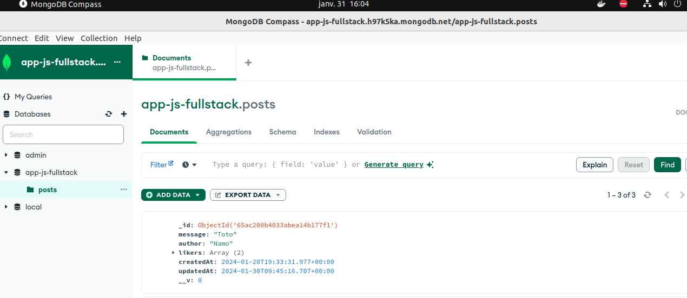

# Projet réseau social décentralisé

# Ce projet est le début d'un réseau social décentralisé dans lequel les données des utilisateurs ne sont pas partagées avec des organisations tierces.

## Les fonctionnalités à développer prochainement sont les suivantes :
-   Intégration de la technologie Blockchain : Permettre le partage transparent des informations entre les utilisateurs.
-   Système de Récompense en Cryptomonnaie : Les utilisateurs gagnent des cryptomonnaies en fonction de leur activité sur la plateforme. Plus ils sont actifs, plus ils en gagnent.
-   Authentification et Messagerie : Développer un système de login avec JWT (JSON Web Token) pour sécuriser l'accès des utilisateurs. Ensuite, mettre en place un système de messagerie pour permettre aux utilisateurs d'interagir entre eux.

## Stack Technologique :

Ce projet est réalisé avec le stack MERN (MongoDB, Express, React, Node).

## Configuration et Installation :

- Installation des Dépendances Backend :`npm i` pour installer les dépendances Back
- Configuration de MongoDB : Entrer son MONGO URI perso dans .env enfin de se connecter à sa base de donnée
- Installation des Dépendances Frontend : `cd frontend` puis `npm i` pour installer les dépendances Front

## Schéma de la Base de Données MongoDB : 

-   
-   

# Dockerisation :

### Frontend :

-   1) Build de l'image frontend :
    -   
-   2) Push de l'image sur Docker hub :
    -   
    -   
    -   Lien image frontend docker hub : https://hub.docker.com/repository/docker/nafise22/mern-project-namo/general
-   3) Création et lancement du container :
    -   
    -   
    4) Arrêt du conteneur :
    -   
    -   

